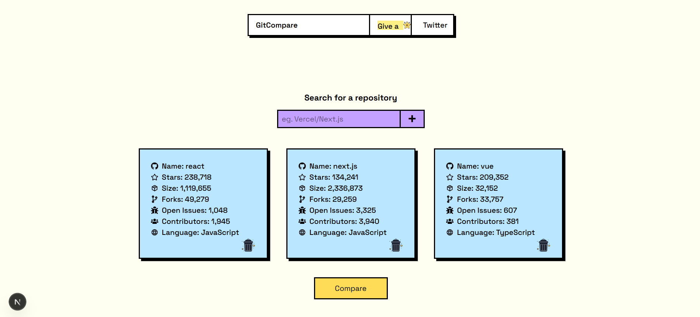

# 🔍 GitCompare

Compare your GitHub repositories side by side and decide which one deserves your next contribution.  
Built with **Next.js + TailwindCSS**, styled like a **retro podium leaderboard** 🏆.

---

## ✨ Features

- ⚡ **Repo Comparison** – See repositories next to each other at a glance.  
- 🎨 **Podium-style UI** – Rank the top 3 repos in a fun, visual way.  
- 📱 **Responsive Design** – Looks great on mobile and desktop.  
- 🖼️ **OG-Ready Metadata** – Share links that look sleek on Twitter, LinkedIn, and Discord.  

---

## 📸 Screenshots

| Podium View | Repo Details |
|-------------|--------------|
|  |  |

---

## 🛠️ Tech Stack

- [Next.js](https://nextjs.org/) – React framework for production.  
- [Tailwind CSS](https://tailwindcss.com/) – Utility-first styling.  
- [React Icons](https://react-icons.github.io/react-icons/) – For GitHub & UI icons.  

---

## 🚀 Getting Started

### 1️⃣ Clone the repo

```bash
git clone https://github.com/yourusername/gitcompare.git
cd gitcompare
```

### 2️⃣ Install dependencies

```bash
npm install
# or
yarn install
```

### 3️⃣ Run locally

```bash
npm run dev
```

Then open 👉 [http://localhost:3000](http://localhost:3000)

---

## ⚙️ Deployment

This project is optimized for **Vercel**:

```bash
vercel deploy
```

---


## 💡 Inspiration

We often have too many repos to pick from 🤯. GitCompare makes it easy to visualize, compare, and decide quickly which project to focus on.  

---

## 🤝 Contributing

Contributions, issues, and feature requests are welcome!  
Feel free to open an [issue](https://github.com/yourusername/gitcompare/issues) or submit a PR.  

---

## 🏅 Acknowledgements

- GitHub API  
- Tailwind CSS Community  
- Next.js Team  

---

## 📜 License

This project is licensed under the **MIT License**.  
You’re free to use, modify, and distribute.  
